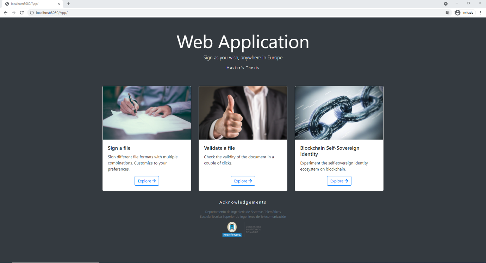
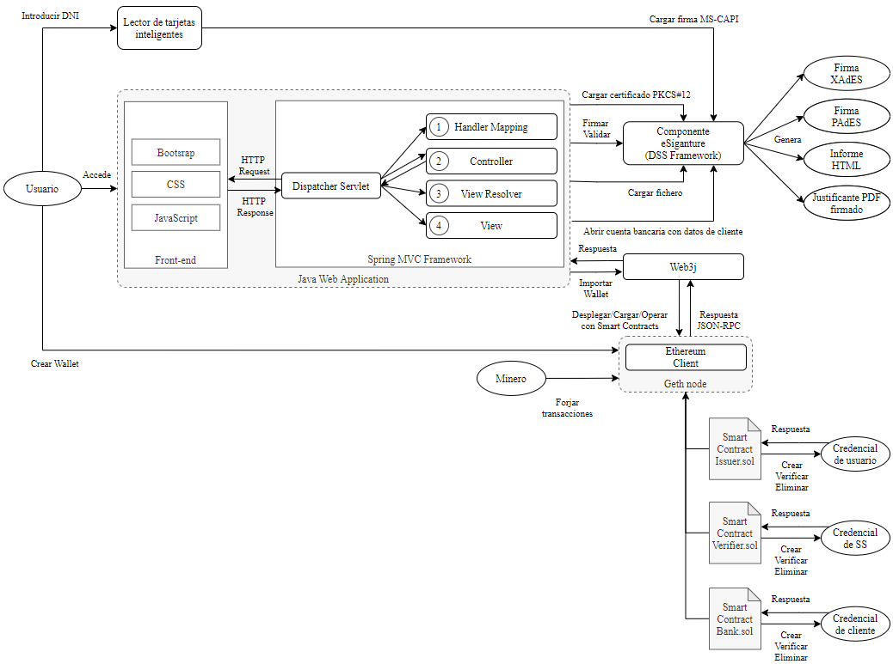

<br/><br/><br/>

# eSignature & blockchain
> Self-sovereign digital identity management with a use case involving electronic signatures.

## About The Project

This project is divided into three distinct scenarios:

<p align="center">
  
</p>

- Creation of customized electronic signatures. You can generate signatures of type PAdES or CAdES, with different packaging (enveloped, enveloping, detached), with different levels of protection (baseline profile -B, -L, -LT or -LTA). This requires the use of a PKCS12 certificate or SmartCard (e.g. ID identifier).

- Validation of electronic signatures using the following formats:
  - XML documents (XAdES format).
  - CMS documents (CAdES format).
  - PDF documents (PAdES format).
  - Documents with base64url encoded content (JAdES compact format).
  - JSON documents (JAdES serialization formats).
  - ASiC with XAdES and CAdES containers.
  - CMS timestamps provided on their own.

- Self-sovereign identity management on the Ethereum blockchain using Smart Contracts.
  - You may apply for credential #1 with first name, last name and gender indicated.
  - You can apply for credential #2 with social security identifier number, sharing and prior consent of credential #1.
  - You can request credential #3 with the client's identification number. This is generated by opening an online account, in which credential #1 and additional personal data will be requested. Finally the client will electronically sign the opening authorization. In addition to the credential #3, a PDF is generated with the inclusion of the information provided and a visible signature.
 
## Legal Aspects

Electronic signatures comply with 

- Regulation (EU) No 910/2014 of the European Parliament and of the Council of 23 July 2014 on electronic identification and trust services for electronic transactions in the internal market and repealing Directive 1999/93/EC.

Data treatment complies with

- Regulation (EU) 2016/679 of the European Parliament and of the Council of 27 April 2016 on the protection of natural persons with regard to the processing of personal data and on the free movement of such data, and repealing Directive 95/46/EC (General Data Protection Regulation.

### Technology used

Java is used as the base of the project in which the Spring MVC framework is integrated, using JSP and Bootstrap for the design and responsiveness of the views. An Ethereum blockchain node is deployed, which communicates with the application using Web3j for the use of smart contracts. For the specific part of the electronic signatures the building block eSignature (DSS framework) provided by the European commission is used.

The complete architecture of the system is shown below, highlighting in gray what has been properly developed.

<p align="center">
  
</p>


### Prerequisites on W10

The following components are necessary (and have been tested) for the execution of the application:
* [Git Bash](https://gitforwindows.org/) (Optional)
* [Eclipse IDE for Enterprise Java and Web Developers](https://www.eclipse.org/downloads/packages/)
* [Java SE 15](https://www.oracle.com/java/technologies/javase/jdk15-archive-downloads.html)
* [Tomcat v9.0](https://tomcat.apache.org/download-90.cgi)
* [Geth v1.9.5 for W10 x64](https://geth.ethereum.org/downloads/)


### Import and project preparation
###### 1. Clone this repository.
```
git clone https://github.com/jrodriguezo/eSignature-blockchain
```
_Note: you can download the repository as .zip_ 
###### 2. Import the project into Eclipse
```
New -> Import -> Existing Projects into Workspace -> Select the workspace downloaded
```
###### 3. Dynamic web
Include Apache Tomcat server as follow:
```
Eclipse -> Preferences -> Server -> Runtime Enviroments -> Select Apache Tomcat v9.0
```

### Deploy and execution of a private blockchain network using Geth
###### 1. Generate genesis.json with Puppeth
Run in a command line window the following
```
> puppeth
> genesis
> 2
> 1
> 1
> 0x
> no
> 1234
```
###### 2. Initialize the node
```
> geth --datadir node init genesis.json
```
###### 3. Open the node console
```
> geth --datadir node --rpcapi eth,web3,personal --allow-insecure-unlock --rpc console
```
And here you will be able to create new accounts through:
```
> personal.newAccount()
```
Or select new miners to get ETHs, and;
```
> miner.setEtherbase('<YOURETHADDRESS>')
```
start to mine.
```
> miner.start()
```
This last command is essential when you use the SSI part of the application, because we will need a miner to build new transactions.
###### 4. Deploy contracts on the node
Here you should have 3 personal newAccount with the roles Issuer, Verifier and Bank (or instead, you can use one account for deploy all contracts).
Once said that, go to src/main/java/es/upm/dit/blockchain/DeployNewContracts.java and change the wallet path file in lines 50, 67, 78.
```js
String walletfile = "PATHTOKEYSTORE";
```
Then, run de java file:
```
right click on DeployNewContracts.java -> Run As -> Java Application
```
And if everything is correct, it will generate a similar output with the contract addresses:
```
----------------------------------------------------------
The address of the Issuer contract is at: 0x406cb623ce36e12155b49be161d2b029a92d5715
----------------------------------------------------------
The address of the Verifier contract is at: 0x124d2e69668be271808cc5a22534172a28faa09c
----------------------------------------------------------
The address of the Bank contract is at: 0xfac417c8c22cf4e0267c9a234686be0786410270
```
Finally, change the address path in Credentials.java, Customer.java and Document.java respectively.
```js
private final static String contractAddress = "0xCONTRACTADDRESS";
```
**Note**: We have used the following configurations as GasProvider but, it may change because it depends on how the node is deployed.
```js
private final static BigInteger GAS_LIMIT = BigInteger.valueOf(0x47b760L);
private final static BigInteger GAS_PRICE = BigInteger.valueOf(1000000000L);
ContractGasProvider gasProvider = new StaticGasProvider(GAS_PRICE, GAS_LIMIT);
```
### Execution under Eclipse
###### 1. Running the Web application in Eclipse
```
Run As -> Run on Server
and from a browser use the following URL
http://localhost:8080/App/
```


## Author 

[@jrodriguezo](https://github.com/jrodriguezo)
